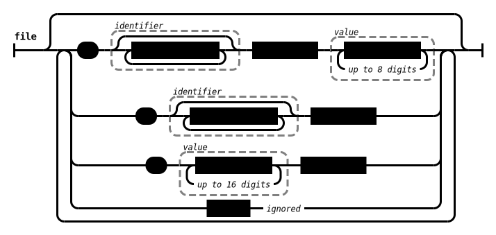

femtoasm
===

femtoasm is a tiny (291 bytes) self-hosting x86-64 assembler inspired by
[stage0](https://github.com/oriansj/stage0).

In fact, the assembler itself takes only 171 bytes - the remaining 120 are
needed for the ELF header.

femtoasm has 3 implementations: [C++23](./src/femtoasm.cpp),
[Flat Assembler](./src/femtoasm.asm) and [femtoasm](./src/femtoasm.fa). Only the
C++23 implementation performs error handling, while the others assume the code
is correct. Otherwise, as long as a program is valid and compiles on the C++23
implementation, all three implementations should generate the exact same binary.

For an example, see femtoasm itself.

Syntax
---

  
  
  
  
